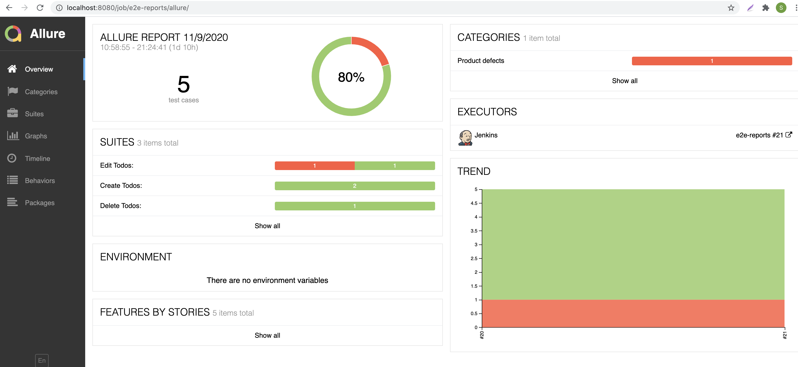
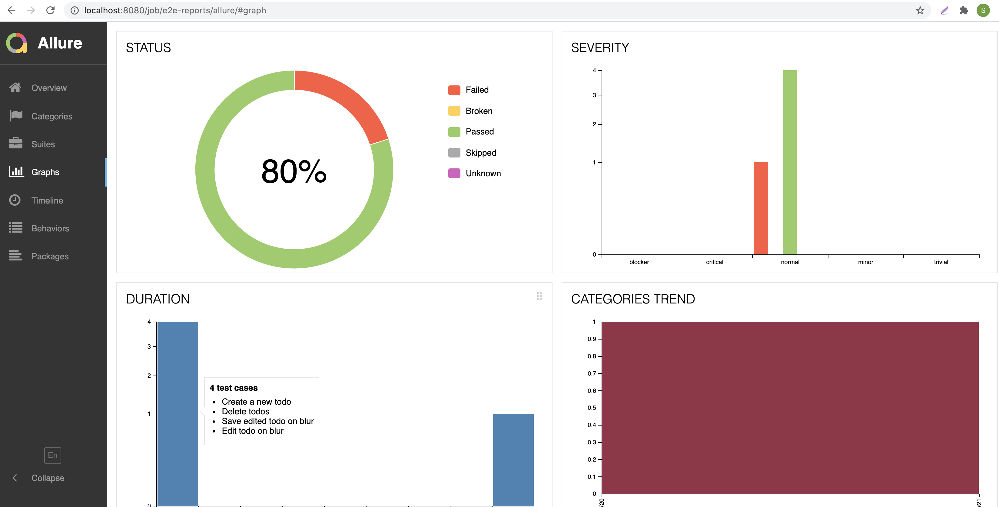

# e2e-reports-demo

## Instructions to create E2E for Vue repo

1. Create VueJS repository and make application available on particular domain.

2. Write e2e test cases based on codeceptjs and Testcafe.

3. Integrate and run the test cases using local jenkins pipeline.

4. Configure Allure to generate reports as below.

